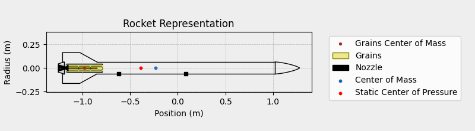
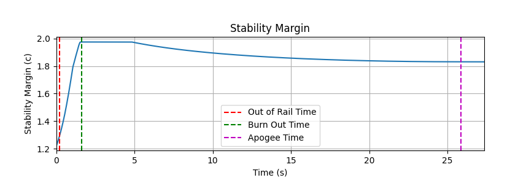
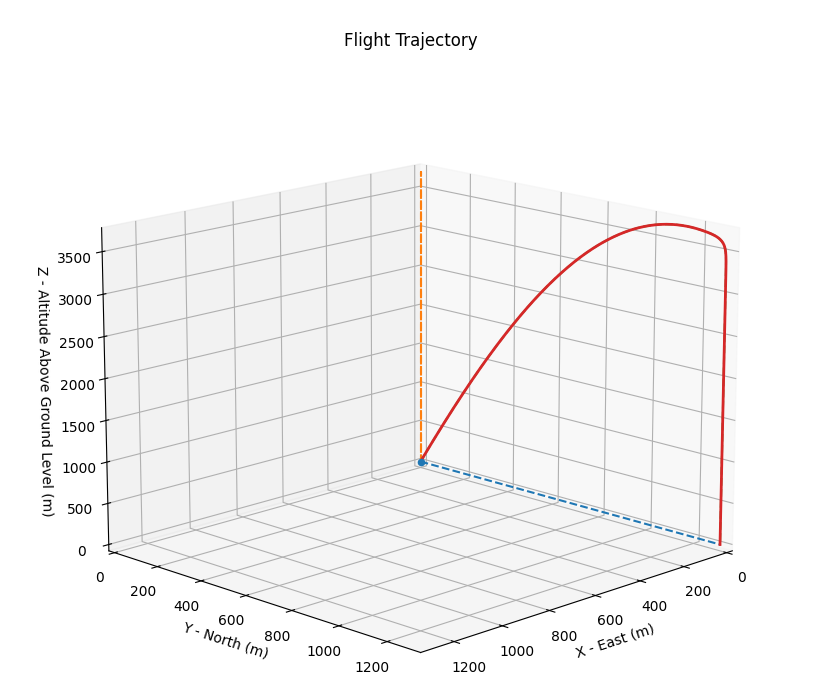

# Run 1 - april 14th 2024
These are the results of the first meaningful simulation run for Antares.

We had a problem that the simulation would halt 2 seconds after the motor stopped giving thrust.
We found out this was caused by an instable rocket. After some more researching, 
we found the fins to be way too small for our rocket. 
Enlarging them considerably improved the stability of the rocket, and yielded our first results.
The rocket parameters can be found in [design.yaml](design.yaml). 
The rocket now looks like this:

The stability-margin before making the fins bigger were below 0, now they look like this:

There is also very good news, we already hit 3.7km! Without weather, but still:

There is some more concerning news though, the acceleration the motor provides seems a lot, 
we're worried that it might not be strong enough. More research will be needed.
- Maximum Speed: 371.140 m/s at 1.53 s
- Maximum Mach Number: 1.095 Mach at 1.54 s
- Maximum Reynolds Number: 3.152e+06 at 1.53 s
- Maximum Dynamic Pressure: 8.193e+04 Pa at 1.53 s
- Maximum Acceleration During Motor Burn: 296.237 m/s² at 0.04 s
- Maximum Gs During Motor Burn: 30.208 g at 0.04 s
